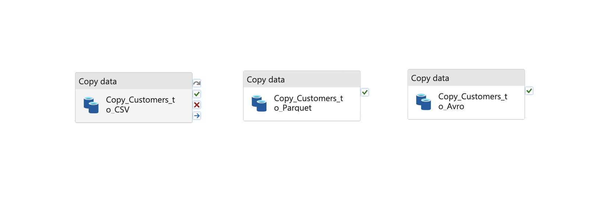

# Week 5 Assignment: Azure Data Factory Data Orchestration 🚀

## 📋 Project Overview

This project demonstrates foundational data engineering tasks using **Azure Data Factory (ADF)**. The goal was to build robust, automated pipelines for extracting, transforming, and loading data between various sources and destinations, covering common real-world scenarios.

---

## 🛠️ Technologies Used

*   **Orchestration:** Azure Data Factory (ADF)
*   **Source Database:** Azure SQL Database (with Northwind sample data)
*   **Destination Database:** Azure SQL Database
*   **File Storage:** Azure Blob Storage
*   **Data Formats:** CSV, Apache Parquet, Apache Avro

---

## 📂 Project Tasks & Implementation

### 1. Copy Data from Database to Multiple File Formats 📄

**Objective:** Extract data from a relational database and export it into CSV, Parquet, and Avro formats.

**Implementation:**
*   A pipeline named `PL_Northwind_To_Files` was created.
*   It contains three parallel `Copy data` activities.
*   **Source:** The `dbo.Customers` table from the `SourceDB` Azure SQL Database.
*   **Sinks:**
    *   **CSV:** For broad compatibility and easy viewing.
    *   **Parquet:** For efficient, columnar storage optimized for analytics.
    *   **Avro:** For compact serialization and robust schema evolution capabilities.
*   The output files were written to separate folders within an Azure Blob Storage container.

## Architecture Diagram


**Evidence of Success:** 📸

**Pipeline for File Formats:**


**Blob Storage Output:**


---

### 2. Automate Pipelines with Triggers 🕒⚡

**Objective:** Automate pipeline execution using both schedule-based and event-based triggers.

**Implementation:**
*   **Schedule Trigger:** A trigger named `TR_Daily_Run_At_5AM` was created to run the `PL_Northwind_To_Files` pipeline every day at 5:00 AM. This is ideal for regular batch processing.
*   **Event Trigger:** A trigger named `TR_On_File_Arrival` was configured to start a pipeline whenever a new blob is created in a specific storage container (`/data-input`). This enables real-time or event-driven workflows.

**Evidence of Success:** 📸

**ADF Triggers:**


---

### 3. Full Database Replication 🔄

**Objective:** Dynamically copy all tables from a source database to a destination database.

**Implementation:**
*   A dynamic pipeline named `PL_Full_DB_Replication` was built.
*   **Step 1 - Lookup:** A `Lookup` activity queries the database's `INFORMATION_SCHEMA.TABLES` to get a list of all user table names.
*   **Step 2 - ForEach Loop:** A `ForEach` activity iterates over the list of table names received from the Lookup.
*   **Step 3 - Dynamic Copy:** Inside the loop, a single `Copy data` activity uses a parameterized dataset. The table name for both the source and sink is set dynamically using the expression `@concat(item().TABLE_SCHEMA, '.[', item().TABLE_NAME, ']')` to handle names with spaces.
*   The Sink is configured with the **`Auto create table`** option, allowing ADF to replicate the schema and data seamlessly.

**Evidence of Success:** 📸

**Dynamic Replication Pipeline:**


**Destination DB Tables:**


---

### 4. Selective Table & Column Copy 🎯

**Objective:** Transfer only specific columns from a specific table to a new destination table.

**Implementation:**
*   A pipeline named `PL_Selective_Product_Copy` was created.
*   It uses a single `Copy data` activity.
*   **Source:** The source configuration uses the **`Query`** option instead of the `Table` option. The following SQL query was used to select only the desired columns from the `dbo.Products` table:
    ```sql
    SELECT
        ProductID,
        ProductName,
        UnitPrice
    FROM
        dbo.Products
    ```
*   **Sink:** The sink writes to a new table named `dbo.Product_Pricing_Info` in the `DestinationDB`, using the `Auto create table` option to create a table with a schema that matches the query result.

**Evidence of Success:** 📸

**Selective Copy Pipeline:**


**Selective Query Results:**


---

## 💡 Key Learnings & Challenges

*   **Dynamic Pipelines:** Mastered the use of `Lookup` and `ForEach` activities to create powerful, metadata-driven pipelines that scale without manual intervention.
*   **Parameterization:** Understood the importance of parameterized datasets and linked services for building reusable components.
*   **Debugging in ADF:** Faced and resolved several real-world challenges, including:
    *   Correctly handling SQL object names with spaces by using bracket `[]` notation.
    *   Diagnosing silent failures by isolating activities and inspecting their detailed JSON inputs and outputs.
    *   Navigating subtle UI behaviors, especially when configuring sink properties and overriding linked services.
*   **Data Formats:** Gained practical experience with the use cases for CSV, Parquet, and Avro in a data pipeline.

This assignment was an excellent practical introduction to the core capabilities of Azure Data Factory as an enterprise-grade data orchestration tool.
